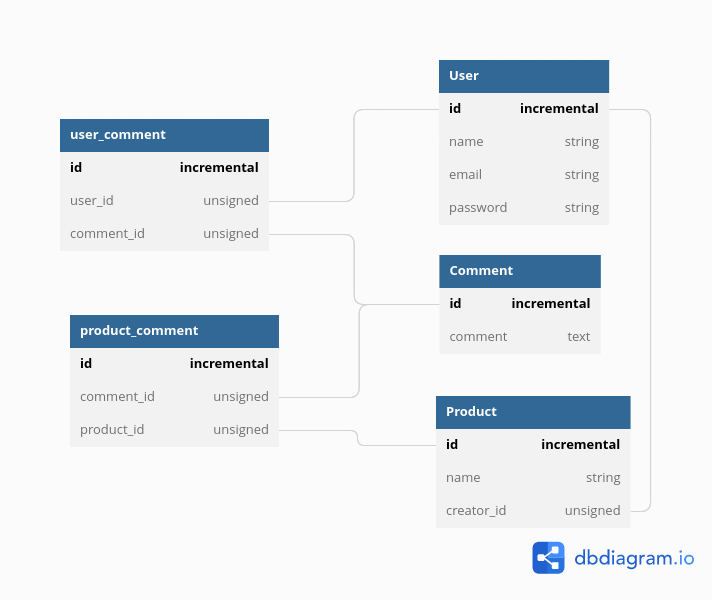

**Table of content**

# product comment manager
php artisan make:model User -rfmsR --test
php artisan make:model Product -rfmsR --test
php artisan make:model Comment -rfmsR --test
php artisan make:model ProductComment -mp
php artisan make:model UserComment -mp
ProductComment

php artisan migrate:fresh
## Database 

## Project Architecture

## Decoupling in Controller and Model with Service and Repository Pattern

## Tests

## Run project with docker compose

## 